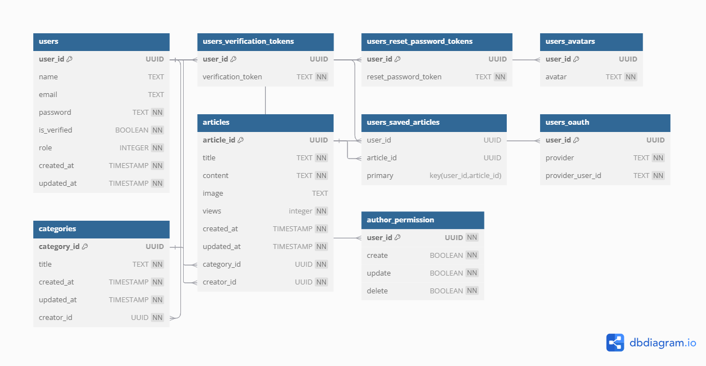

# FactEcho ERD Design Specification

This document explores the design of our app FactEcho.

## **Table of Contents**
- [Storage](#storage)
  - [ERD](#erd)
  - [Tables](#tables)
- [APIs](#apis)
- [UI Design](#ui-design)
- [Auth](#auth)


## **Storage**

We'll use a relational database (schema follows) for strong organized and scalable database. We 'll use PostgreSQL.

### ERD


### Tables



## **APIs**

**Auth**:

```
post: /auth/register
post: /auth/login
get: /auth/refresh
get: /auth/logout
get: /auth/verifyAccount
post: /auth/forgetPassword
get: /auth/resetPassword
post: /auth/resetPassword
```

**Users**:

```
get: /users
get: /users/search
get: /users/userId
patch: /users/userId/common
patch: /users/userId/role
patch: /users/userId/password
patch: /users/userId/avatar
delete: /users/userId
get: /users/userId/save
post: /users/userId/save/articleId
delete: /users/userId/save/articleId
```

**Authors**:

```
get: /authors
get: /authors/search
get: /authors/authorId
patch: /authors/authorId/permissions
get: /authors/authorId/articles
```

**Categories**:

```
get: /categories
get: /categories/search
post: /categories
get: /categories/categoryId
patch: /categories/categoryId
delete: /categories/categoryId
get: /categories/categoryId/articles
```

**Articles**:

```
get: /articles
get: /articles/search
get: /articles/explore
get: /articles/trend
get: /articles/latest
post: /articles
get: /articles/articleId
patch: /articles/articleId/common
patch: /articles/articleId/image
delete: /articles/articleId
```

## **UI Design**

Follow [./UI.Snapshots.md](./UI.Snapshots.md)

## **Auth**

For v1, a simple JWT-based auth mechanism is to be used, with passwords
encrypted and stored in the database. OAuth is to be added initially or later
for Google, X and Facebook.
